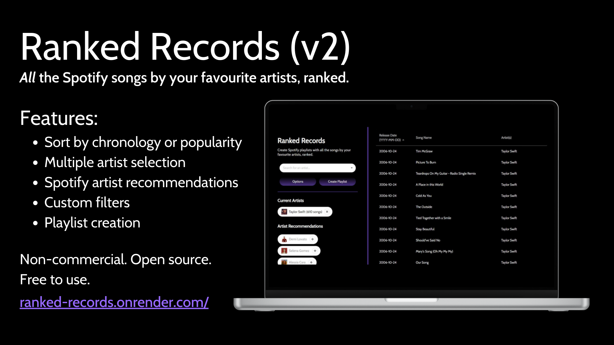

# Ranked Records

Ranked Records is a web application that lets you create playlists that include **all** songs from an artist, ordered by either popularity or release date. It supports adding mulitple artists, and uses Spotify artist recommendations to suggest similar ones.

The project is hosted with Render, at [https://ranked-records.onrender.com/](https://ranked-records.onrender.com/). 

## Development Notes
Mainly things for myself later, but this repo is cloneable and runnable if you want to play around with it.

### Run Instructions
1. cd into client folder and run `npm install` then `npm start`
   - This will start the react app on localhost:3000
2. cd into server folder and run `npm install` then `node server.js`
   - This will start the server on localhost:3001

### Environment Configurations
The following variables need to be set:
- SECRET
- PORT
- LOGIN_URL
- REACT_APP_CURRENT_URL

## Issues
If you have feedback/issues/feature requests, you can create an issue or [submit it in this Google Form](https://docs.google.com/forms/d/e/1FAIpQLSfuvloB2JpKfFJ1BMfxofnguX7seRUcm8TCa1O59jnErDJmzA/viewform).

## References
I referenced [this YouTube tutorial](https://www.youtube.com/watch?v=Xcet6msf3eE) to get started.

## Contributing
Contributing for this project is currently **closed**. However, I do plan on adding it in the future, so you can star this repository to get notified when that happens!
